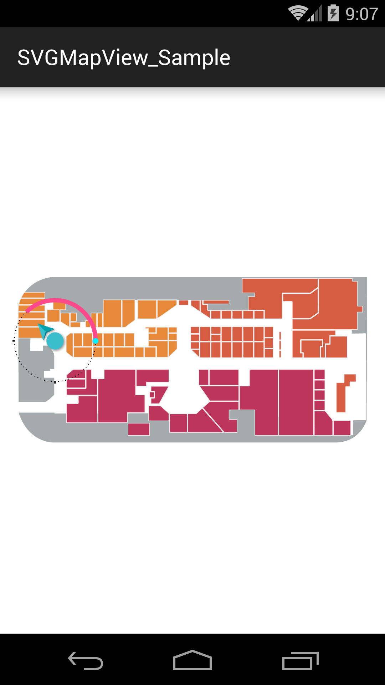
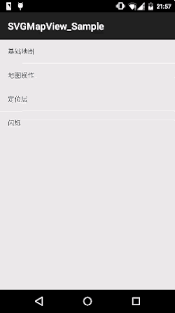

# SVGMapView
It was a SVG indoor map engine for Android.  

These figures show the application for indoor map  





## System Requirement
Android v2.2+

## TODO
Developed by Android Studio

## Usage
### Add View Layout
```xml
<com.jiahuan.svgmapview.SVGMapView
  android:id="@+id/mapView"
  android:layout_width="match_parent"
  android:layout_height="match_parent">
</com.jiahuan.svgmapview.SVGMapView>
```

### Java
```java
SVGMapView mapView = (SVGMapView) findViewById(R.id.mapView);
```

### Lifecycle
```java
@Override
protected void onPause()
{
  super.onPause();
  mapView.onPause();
}

@Override
protected void onResume()
{
  super.onResume();
  mapView.onResume();
}

@Override
protected void onDestroy()
{
  super.onDestroy();
  mapView.onDestroy();
}
```

### Load Map
```java
// load svg string
mapView.loadMap(AssetsHelper.getContent(this, "sample2.svg"));
```

## Overlays
SVGMapView also provides some common overlays, which are normally seen in map applications.
### LocationOverlay
```java
SVGMapLocationOverlay locationOverlay = new SVGMapLocationOverlay(mapView);
locationOverlay.setIndicatorArrowBitmap(BitmapFactory.decodeResource(getResources(), R.mipmap.indicator_arrow));
locationOverlay.setPosition(new PointF(400, 500));
locationOverlay.setIndicatorCircleRotateDegree(90);
locationOverlay.setMode(SVGMapLocationOverlay.MODE_COMPASS);
locationOverlay.setIndicatorArrowRotateDegree(-45);
mapView.getOverLays().add(locationOverlay);
mapView.refresh();
```

## Map Control
### Spark
```java
mapView.getController().sparkAtPoint(new PointF(random.nextInt(1000), random.nextInt(1000)), 100, color, 10);
```

## References
SVG parse util from https://github.com/japgolly/svg-android.git


## License
Copyright 2015 JiaHuan

Licensed under the Apache License, Version 2.0 (the "License");
you may not use this file except in compliance with the License.
You may obtain a copy of the License at

http://www.apache.org/licenses/LICENSE-2.0

Unless required by applicable law or agreed to in writing, software
distributed under the License is distributed on an "AS IS" BASIS,
WITHOUT WARRANTIES OR CONDITIONS OF ANY KIND, either express or implied.
See the License for the specific language governing permissions and limitations under the License.


